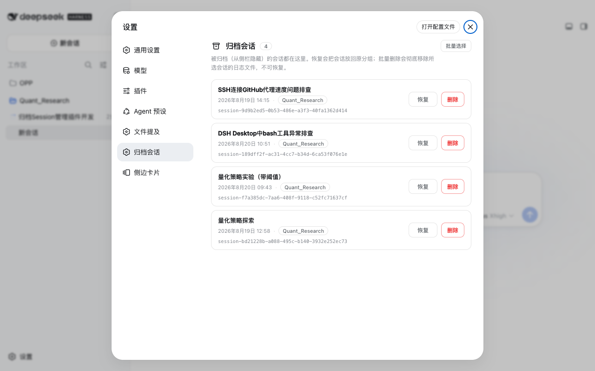
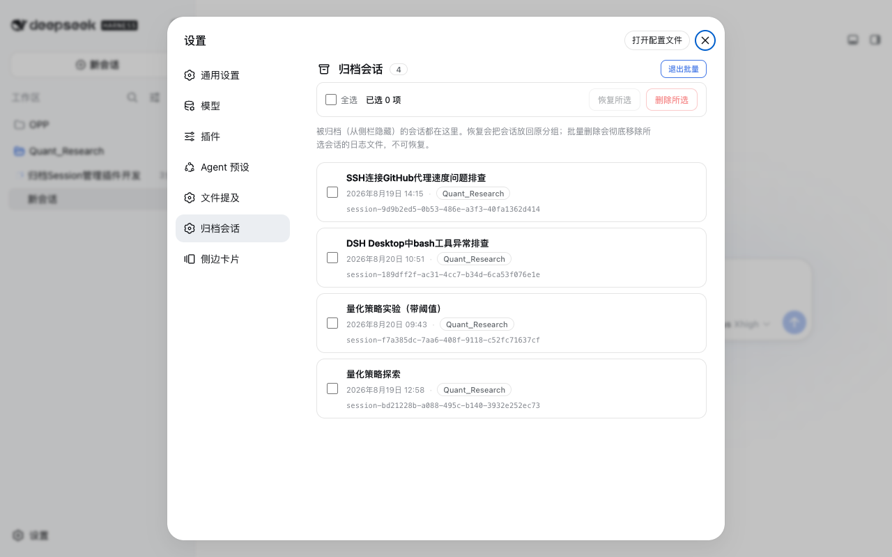

# dsh-archived-sessions

> [English](./README.en.md) | 中文

> DSH 设置面板「归档会话」管理器：查看、恢复、彻底删除已归档的 session。
> 带归档 logo、会话日期、所属工作区标签，以及**批量多选**（恢复所选 / 删除所选）。
> 另有**「移动会话」**面板，可把任意会话移动到不同工作区（现有或新建目录）。

一个 DSH 持久化插件（host + browser 双半）。在 **设置 → 归档会话** 里管理所有被归档（从侧栏隐藏）的会话；在 **设置 → 移动会话** 里把会话迁移到其它工作区。

## 功能

- **查看**：列出全部已归档会话，每行显示 —— 标题（缺失时回退到首条用户消息）、**会话日期**（createdAt，中文格式）、**所属工作区标签**（标题或目录名；原工作区已删除时显示虚线「工作区已删 · 目录名」）。
- **恢复**：取消归档，放回原分组。
- **彻底删除**：物理删除会话日志文件 + 解除工作区归属，**不可恢复**（删除前有二次确认）。
- **批量多选**：一键进入批量模式，全选 / 恢复所选 / 删除所选（批量删除一次二次确认）。
- **移动会话到工作区**：`设置 → 移动会话` 列出全部会话（含已归档），任选**已有工作区**或**新建目录路径**（自动创建）后确认，即把该会话的工作目录与日志合迁移过去，会话随之下滑到对应工作区分组；处于打开状态的会话需先切走。
- **自适应 UI**：深浅色跟随主题 token，窄屏自动纵向堆叠；加载/空/错误/操作中状态齐全；支持键盘焦点、`prefers-reduced-motion`。

## 截图





## 安装

```sh
# 方式一：Git 依赖直装（推荐，无需本地 clone，重启 DSH 生效）
dsh plugin --profile desktop add "github:TOBYCAI/dsh-archived-sessions"

# web 端（若你也用 dsh web）：
dsh plugin --profile web add "github:TOBYCAI/dsh-archived-sessions"

# 方式二：本地 link（开发调试）
git clone https://github.com/TOBYCAI/dsh-archived-sessions.git
dsh plugin --profile desktop add link:/path/to/dsh-archived-sessions
```

> 装完**重启 DSH**（或刷新页面重新加载 bundle）后，设置 → 归档会话 即可用。

## 卸载

```sh
dsh plugin --profile desktop remove dsh-archived-sessions
dsh plugin --profile web remove dsh-archived-sessions
```

## 结构

```
package.json       npm 元数据 + dsh.bundle.patch + dsh.client（浏览器半注册）
cordis.patch.yml   向 profile bundle 插入本插件行
src/index.js       host 源码（/archived-sessions/* JSON 路由）
src/client/index.jsx  client 源码（React，settings.section）
build.mjs          esbuild 构建脚本（本地开发时生成 lib/）
lib/index.js       预构建 host（ESM）
lib/client.js      预构建 client（ModuleLoader CJS handshake）
```

`lib/` 已预构建，clone 下来即可直接用、无需 esbuild。若要改源码，运行 `npm i -D esbuild && npm run build` 重新生成 `lib/`。

## Host 路由

| 方法 | 路径 | 说明 |
|---|---|---|
| POST | `/archived-sessions/list` | 列出归档会话（跳过已删除/不存在者） |
| POST | `/archived-sessions/restore` | 取消归档单个 |
| POST | `/archived-sessions/restore-many` | 批量取消归档 |
| POST | `/archived-sessions/delete` | 彻底删除单个（物理删日志，保持隐藏） |
| POST | `/archived-sessions/delete-many` | 批量彻底删除 |
| POST | `/archived-sessions/sessions` | 列出全部会话（含已归档标记），供「移动会话」面板 |
| POST | `/archived-sessions/workspaces` | 列出可选目标工作区 |
| POST | `/archived-sessions/move` | 把会话移动到目标工作区 `{ sessionId, targetPath }` |

> 删除时会**保留归档位**（不取消归档），从而不会把会话放回侧栏/未分组；并跳过日志已不存在的条目。
> DSH 本身没有官方 session 删除接口，本插件是「物理删日志 + 解除归属 + 保持隐藏」的实现。

## 兼容性

- DSH Desktop / web 均可（同一套 host + client）。
- peerDependencies 见 `package.json`；`react`、`@deepseek-ai/*` 由 DSH 运行时提供。

## License

[MIT](./LICENSE) © TOBYCAI
